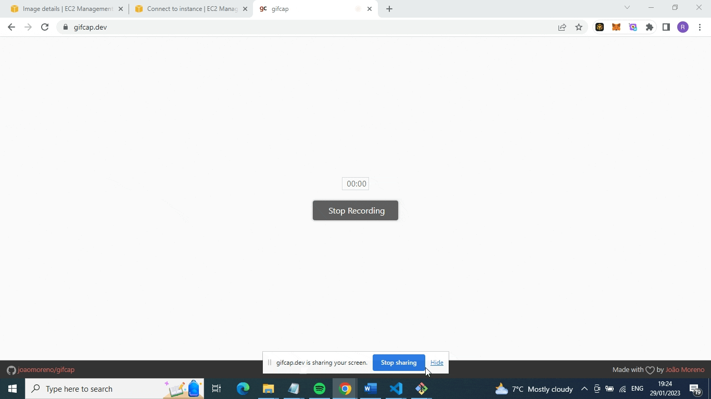

# PACKER-> AWS CHALLENGE

Create a Packer file that creates an AMI that is provisioned for MongoDB. Run mongosh on your machine to show the configuration with Packer has been successful.

## Demo



## Notes

### Added variables: builders and provisioners

```
"provisioners": [
    {
      "type": "file",
      "source": "env",
      "destination": "/home/ubuntu/env"
    },
    {
      "type": "shell",
      "script": "./env/mongodb/script.sh"
    }
  ]
```

### Added mongod.service

```
[Unit]
Description=Start mongodb

[Service]
User=ubuntu
WorkingDirectory=/home/ubuntu
ExecStart=/usr/bin/mongod --quiet --auth --config /etc/mongod.conf
Restart=always

[Install]
WantedBy=multi-user.target
```

### Fixed installation error for MongoDB. Changed list file to:

```
deb [ arch=amd64,arm64 ] https://repo.mongodb.org/apt/ubuntu bionic/mongodb-org/6.0 multiverse" | sudo tee /etc/apt/sources.list.d/mongodb-org-6.0.list
~~~
```
